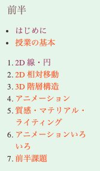

CG演習のmac 利用者向けのページです。 
各回の内容は branch として追加されていきます。(あまり正しいつかいかたではない) 
~~基本的には本来の授業資料と異なる部分に絞って説明するつもりなので、大変ですが授業のほうとも照らし合わせて学習を進めてください。~~
現在はもとの授業資料と異なる部分の説明ですが、この資料だけで完結するように順次追記していく予定です。

## 目次
* [授業資料](#授業資料)
* [各資料について](#各資料について)
  * [従来資料との違いはなにか](#従来資料との違いはなにか)
  * [フォルダの構成](#フォルダの構成)
* [連絡先](#連絡先)
* [よくある質問](#よくある質問)  

## 授業資料
各項目はもとの授業資料の番号に対応しています。一回の授業で複数のサンプルプログラムを使うことがあります。先の内容もここに順次追加予定です。 
*(もとの資料より)*

**第０回**　[環境構築 ( 0_HelloWorld )](https://github.com/trnciii/cge2020mac/tree/0_HelloWorld) 
**第１回**　[一本の線を描く ( 1_lines )](https://github.com/trnciii/cge2020mac/tree/1_lines) 
**第１回**　[円を描く ( 1_circle )](https://github.com/trnciii/cge2020mac/tree/1_circle) 
**第２回**　[相対移動 ( 2_surface)](https://github.com/trnciii/cge2020mac/tree/2_surface) 

## 各資料について
### 従来資料との違いはなにか
一番上にも少し述べましたが、これはライブラリが古いCG演習の教材をmac/xcode 上で利用してもらうために移植したものです。主に各自の環境をそろえやすくすることを目的に、インストールが楽である最新バージョンのライブラリを使っています。その関係で従来の教材とは**ウィンドウ関連の処理の書き方が違います**。

基本的には、それぞれのプログラムに書かれている関数のうち
* **void myinit** に関連する処理が**異なります**
* **void reshape**　に関連する処理が**異なります**

そして
* **void display** に関連する処理は**共通です**

~~本資料での説明は従来と異なる部分だけに留めて共通する説明は元の資料のほうを読んでもらう形にしています。 mac 利用者のかたは2つのサイトを行き来するという大変になってしまうのですが、全体的にみて説明が共通する部分が多いためこのような形をとっています。~~ 
現時点では従来と異なる部分だけの解説のみ書かれており、共通する説明は元の資料のほうを読んでもらう形にしています。

### フォルダの構成
基本的にすべてのサンプルプログラムが以下のようなフォルダ構成になっています。

 
src フォルダの中に `main.cpp` というファイルが存在しており、だいたいここにプログラムが書かれています。授業の回によってはほかのソースやヘッダが一緒に入っています。

## 連絡先
プログラムが動かないという報告や、わからない部分の質問等をどこでうけつけるかがまだ決まってません。とりあえずこの資料を作った土井には以下で連絡がつきます。 

doi.kohei.682@s.kyushu-u.ac.jp 
[@trnciii](https://twitter.com/trnciii)

あとは先生やほかのTAにも聞きにいきましょう。 
プログラムの修正や質問などなんでも歓迎します(たぶん)。

## よくある質問

### Q. GLFW/glfw3.h file not found とエラーが出る
A. フォルダが実在するか確認, バージョンの数字などは自分の環境にあわせる

### Q. コンパイルできるが、実行すると "abort with payload" とでる
A. とりあえず配布してるファイルのビルド/実行を試してみてください。ライブラリを見つけきれてないようで、他の事例とあわせて調査中です。
