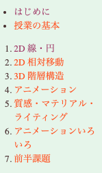

CG演習のmac 利用者向けのページです。

各回の内容は branch として追加されていきます。(あまり正しいつかいかたではない)

## 目次
* [授業資料](#授業資料)
* [各資料について](#各資料について)
  * [従来資料との違いはなにか](#従来資料との違いはなにか)
  * [フォルダの構成](#フォルダの構成)
* [連絡先](#連絡先)
* [よくある質問](#よくある質問)  

## 授業資料
各項目はもとの授業資料の番号に対応しています。

### 前半

|回|タイトル|branch (リンク)|
|:-|:-|:-|
|--|環境構築			|[0_HelloWorld](https://github.com/trnciii/cge2020mac/tree/0_HelloWorld)|
|第1回|一本の線を描く		|[1_lines](https://github.com/trnciii/cge2020mac/tree/1_lines)|
|第1回|円を描く			|[1_circle](https://github.com/trnciii/cge2020mac/tree/1_circle)|
|第2回|相対移動			|[2_surface](https://github.com/trnciii/cge2020mac/tree/2_surface)|
|第3回|陰面消去 & 階層構造	|[3_box](https://github.com/trnciii/cge2020mac/tree/3_box)|
|第4回|アニメーション		|[4_animation](https://github.com/trnciii/cge2020mac/tree/4_animation)|
|第5回|質感 & ライティング  |[5_material](https://github.com/trnciii/cge2020mac/tree/5_material)|

### 後半

|回|タイトル|branch (リンク)|
|:-|:-|:-|
|第1回|マウスやキーボードによる入力|[11_input101](https://github.com/trnciii/cge2020mac/tree/11_input101)|
|第2回|ワンクリックアクションの制作|[12_oneclick](https://github.com/trnciii/cge2020mac/tree/12_oneclick)|
|第3回|タイミングアクション|[13_timing](https://github.com/trnciii/cge2020mac/tree/13_timing)|
|第4回|軌跡を用いたインタラクション|[14_trace](https://github.com/trnciii/cge2020mac/tree/14_trace)|

---

## 各資料について
### 従来資料との違いはなにか
一番上にも少し述べましたが、これはライブラリが古いCG演習の教材をmac/xcode 上で利用してもらうために移植したものです。
主に各自の環境をそろえやすくすることを目的に、インストールが楽である最新バージョンのライブラリを使っています。
その関係で従来の教材とは**ウィンドウ関連の処理の書き方が違います**。

**基本的には**、それぞれのプログラムに書かれている関数のうち

* `void myinit` に関連する処理が**異なります**
* `void reshape`　に関連する処理が**異なります**

そして

* `void display` に関連する処理は**共通です**

もとの教材を参照するときはこのことに注意してください。

### フォルダの構成
基本的にすべてのサンプルプログラムが以下のようなフォルダ構成になっています。

 
src フォルダの中に `main.cpp` というファイルが存在しており、だいたいここにプログラムが書かれています。
授業の回によってはほかのソースやヘッダが一緒に入っています。

## 連絡先

不具合報告や質問は授業slack のほうで受け付けています。
また予備として、この資料を作った土井には以下で連絡がつきます。

doi.kohei.682@s.kyushu-u.ac.jp

[@trnciii](https://twitter.com/trnciii)

あとは先生やほかのTAにも聞きにいきましょう。
プログラムの修正や質問などなんでも歓迎します(たぶん)。

## よくある質問

### Q. GLFW/glfw3.h file not found とエラーが出る
A. フォルダが実在するか確認, バージョンの数字などは自分の環境にあわせる

### Q. コンパイルできるが、実行すると "abort with payload" とでる
A. macの権限まわりが原因でこういうことが起きるようです。
Xcodeの設定で *signing/capabilities* のところに *Hardened Runtime* という項目があったら、削除したのち実行してみてください。

* 権限がきつくない状態

* もしこの項目があれば削除

