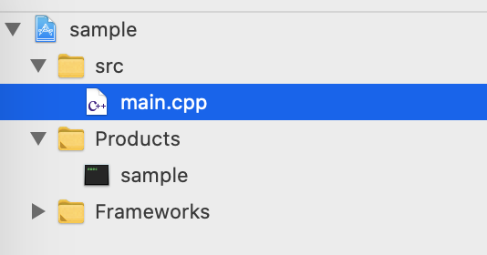

# Home

コンテンツインタラクション演習 の macOS 利用者向けのページです。

## このテキストの使い方

このページの左側には、授業の各回に対応した章の目次が表示されます。
毎回の授業でやる内容を確認し、その章にしたがって学習を進めてください。
目次がウィンドウの幅によっては折り畳まれているかもしれません。
その場合は左上にある[三]メニューから表示できます。

### 従来資料との違いはなにか
はじめにも少し述べましたが、これはライブラリが古かったWindows向けの教材を、macOS/xcode 上で学習できるよう移植したものです。
受講生が自力で環境を整えやすくすることを目的に、インストールが楽である最新バージョンのGLFW3というライブラリを使っています。
その関係で従来の教材とは**ウィンドウ関連の処理の書き方が違います**。

**基本的には**、それぞれのプログラムに書かれている関数のうち

* `void myinit` に関連する処理が**異なります**
* `void reshape`　に関連する処理が**異なります**

そして

* `void display` に関連する処理は**共通です**

もとの教材を参照するときはこのことに注意してください。

### フォルダの構成
基本的にすべてのサンプルプログラムが以下のようなフォルダ構成になっています。

 
src フォルダの中に `main.cpp` というファイルが存在しており、だいたいここにプログラムが書かれています。
授業の回によってはほかのソースやヘッダが一緒に入っています。

## 連絡先

不具合報告や質問は授業slack のほうで受け付けています。
また予備として、この資料を作った土井には以下で連絡がつきます。

[doi.kohei.682@s.kyushu-u.ac.jp](doi.kohei.682@s.kyushu-u.ac.jp)

[@trnciii](https://twitter.com/trnciii)

あとは先生やほかのTAにも聞きにいきましょう。
プログラムの修正や質問などなんでも歓迎します(たぶん)。
